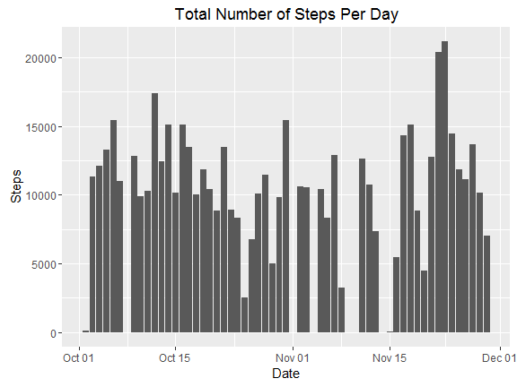
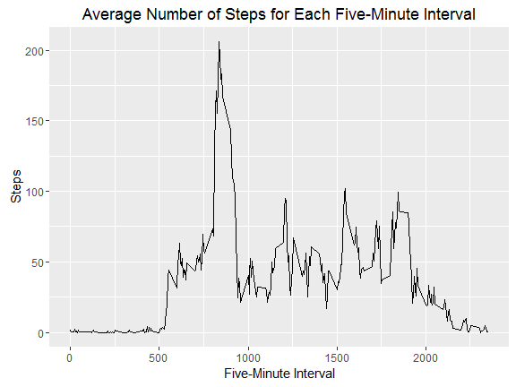
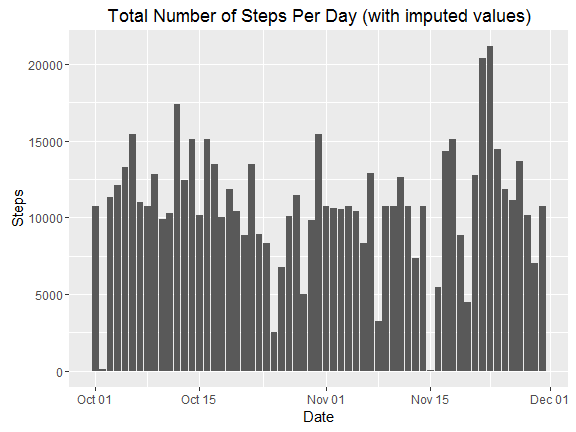
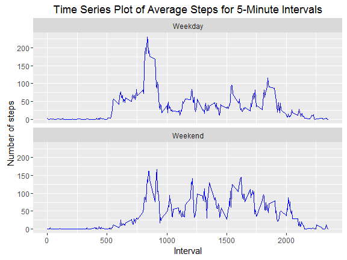

# Reproducible Research: Peer Assessment 1
### Will Luft

## 1. Loading and preprocessing the data

Load packages for data analysis

```r
library(ggplot2)
library(dplyr)
```

```
## 
## Attaching package: 'dplyr'
```

```
## The following objects are masked from 'package:stats':
## 
##     filter, lag
```

```
## The following objects are masked from 'package:base':
## 
##     intersect, setdiff, setequal, union
```

Unzip the zip file

```r
unzip(zipfile = "activity.zip")
```

Read the data into R

```r
steps_data <- read.csv("activity.csv")
```

Create dataset without missing values

```r
steps_data_complete <- na.omit(steps_data)
```

## 2. What is mean total number of steps taken per day?
Create a new data frame with the sum of the steps for each date and name the 
columns appropriately

```r
steps_per_day <- with(steps_data_complete, aggregate(steps, by = list(date),
                                                     sum))
names(steps_per_day) <- c("Date", "Steps")
steps_per_day$Date <- as.Date(steps_per_day$Date)
```

Histogram showing the number of steps for each day

```r
steps_bar_plot <- ggplot(steps_per_day, aes(x = Date, y = Steps)) +
        geom_bar(stat = "identity") +
        labs(title = "Total Number of Steps Per Day", x = "Date", y = "Steps")
print(steps_bar_plot)
```

<!-- -->

Calculate the average number of steps per day

```r
avg_steps <- round(mean(steps_per_day$Steps), digits = 3)
avg_steps
```

```
## [1] 10766.19
```

Caluculate the median number of steps per day

```r
median_steps <- median(steps_per_day$Steps)
median_steps
```

```
## [1] 10765
```

## 3. What is the average daily activity pattern?
Get the average number of steps for each 5 minute time frame 

```r
interval_averages <- tapply(steps_data_complete$steps,
                            steps_data_complete$interval, mean)
interval_avg_df <- data.frame(interval = as.integer(names(interval_averages)),
                              steps = interval_averages)
```

Create a time series plot of the 5-minute interval

```r
interval_plot <- ggplot(interval_avg_df, aes(x = interval, y = steps)) +
        geom_line() +
        labs(title = "Average Number of Steps for Each Five-Minute Interval",
             x = "Five-Minute Interval",
             y = "Steps")
print(interval_plot)
```

<!-- -->

Find the 5-minute interval with the highest average steps

```r
interval_avg_df[interval_avg_df$steps == max(interval_avg_df$steps),]
```

```
##     interval    steps
## 835      835 206.1698
```

## 4. Imputing missing values
Calculate the total number of missing values in the dataset

```r
rows_with_na <- sum(!complete.cases(steps_data))
```
The total number of rows with missing values is 2304.

Imputing missing values by using the average for the same 5-minute interval

```r
imp_steps_data <- steps_data
missing_rows <- !complete.cases(steps_data$steps)

imp_steps_data$steps[missing_rows] <- interval_averages[as.character(imp_steps_data$interval[missing_rows])]
```

Histogram of the total number of steps taken each day for the imputed data

```r
## Creating a new dataframe with the total number of steps per day
imp_steps_per_day <- with(imp_steps_data, aggregate(steps, by = list(date),
                                                     sum))
names(imp_steps_per_day) <- c("Date", "Steps")
imp_steps_per_day$Date <- as.Date(imp_steps_per_day$Date)

## Creating the histogram
imp_steps_bar_plot <- ggplot(imp_steps_per_day, aes(x = Date, y = Steps)) +
        geom_bar(stat = "identity") +
        labs(title = "Total Number of Steps Per Day (with imputed values)",
             x = "Date", y = "Steps")
print(imp_steps_bar_plot)
```

<!-- -->

Calculate the average number of steps per day for the imputed data

```r
imp_avg_steps <- round(mean(imp_steps_per_day$Steps), digits = 3)
imp_avg_steps
```

```
## [1] 10766.19
```

Caluculate the median number of steps per day for the imputed data

```r
imp_median_steps <- median(imp_steps_per_day$Steps)
imp_median_steps
```

```
## [1] 10766.19
```
By changing the missing values to the average number of steps for the
corresponding 5-minute interval, the average number of steps per day increases.

## 5. Are there differences in activity patterns between weekdays and weekends?
Create a dataframe with a new column specifying if a day is a weekday or weekend

```r
imp_steps_data$date <- as.Date(as.character(imp_steps_data$date), "%Y-%m-%d")
days <- weekdays(imp_steps_data$date)                                         
for(i in 1:length(days)) {                                                    
        if(days[i] %in% c("Saturday", "Sunday")) days[i] = "Weekend"
        else days[i] = "Weekday" }
imp_steps_data$day <- as.factor(days)                                         
avg_days <- aggregate(steps ~ interval + day, data = imp_steps_data, mean)  
```

Panel time-series plot for the 5-minute intervals for weekdays and weekends

```r
day_plot <- ggplot(avg_days, aes(x = interval, y = steps)) + geom_line(color = "blue") + 
        facet_wrap( ~ day, nrow = 2, ncol = 1) +
        labs(title = "Time Series Plot of Average Steps for 5-Minute Intervals",
             x = "Interval", y = "Number of steps")
print(day_plot)
```

<!-- -->


