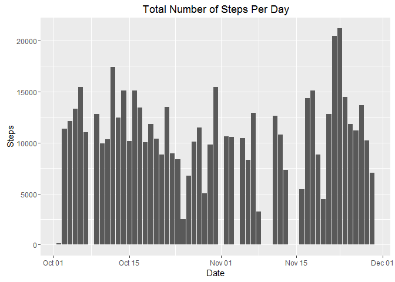

# Reproducible Research: Peer Assessment 1
### Will Luft

## 1. Loading and preprocessing the data

Load packages for data analysis:

```r
library(ggplot2)
library(dplyr)
```

```
## 
## Attaching package: 'dplyr'
```

```
## The following objects are masked from 'package:stats':
## 
##     filter, lag
```

```
## The following objects are masked from 'package:base':
## 
##     intersect, setdiff, setequal, union
```

Unzip the zip file

```r
unzip(zipfile = "activity.zip")
```

Read the data into R

```r
steps_data <- read.csv("activity.csv")
```

Create dataset without missing values

```r
steps_data_complete <- na.omit(steps_data)
```

## 2. What is mean total number of steps taken per day?
Create a new data frame with the sum of the steps for each date and name the 
columns appropriately

```r
steps_per_day <- with(steps_data_complete, aggregate(steps, by = list(date),
                                                     sum))
names(steps_per_day) <- c("Date", "Steps")
steps_per_day$Date <- as.Date(steps_per_day$Date)
```

Barplot showing the number of steps for each day

```r
steps_bar_plot <- ggplot(steps_per_day, aes(x = Date, y = Steps)) +
        geom_bar(stat = "identity") +
        labs(title = "Total Number of Steps Per Day", x = "Date", y = "Steps")
print(steps_bar_plot)
```

<!-- -->

Calculate the average number of steps per day

```r
avg_steps <- round(mean(steps_per_day$Steps), digits = 3)
```

Caluculate the median number of steps per day

```r
median_steps <- median(steps_per_day$Steps)
```

The average number of steps per day is 1.0766189\times 10^{4} and the median number of
steps per day is 10765.


## 3. What is the average daily activity pattern?


## 4. Imputing missing values


## 5. Are there differences in activity patterns between weekdays and weekends?
